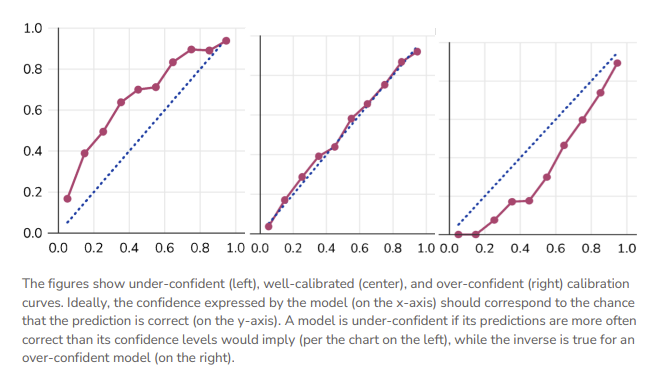

# Why this matters
Fisheries science leans heavily on simulation and estimation, and deserves a shared way to communicate the tradeoffs between model performance and confidence. It'd also be great to have **a diagnostic that can tell us what is mis-specified in our model**, especially in the spooky-yet-common situation of an unbiased estimator with correctly-specified standard errors that still produce mis-calibrated confidence interval. 

This post introduces the calibration concept as commonly implemented in AI/ML to the fisheries science audience, and presents three key ways (coverage probabilities, 'true' calibration, forecast intervals) that we can start talking about and communicating process-estimation certainty from our models, borrowing from the uncertainty quantification techniques leveraged in AI/ML. 

None of these techniques are brand-new, but I'm writing this blog specifically because I've seen confusion in the literature about how to talk about this.

>Looking at a simple bias-variance tradeoff plot won't get us there.

# Calibration: a framework for communicating uncertainty  

The statistical concept of "Calibration" asks: **do our probabilistic statements match reality?** We make such statements implicitly in fisheries when we present confidence intervals around parameter estimates or time-series of derived quantities (past or future). 

However, there's a subtle difference between what most ML modelers think of as calibration, which I'll call here *probability calibration*, and the familiar metrics we apply to parameter-estimation exercises, which is better described as *coverage calibration*. 

> What can the fish-sci/assessment communities  gain by integrating these approaches?

## Probability Calibration in ML modeling

In ML, a "calibration curve" is a visual representation of the tradeoffs between model confidence and accuracy. These are trivially straightforward to produce for common ML frameworks like classifiers, because the *model's confidence in its prediction and the prediction itself are one and the same*.

We can then compare the model's prediction to the empirical truth and construct a **calibration curve**, whereby the 1:1 line ('perfectly calibrated') satisfies $P(event |model \space predicts \space p) = p$.  

 
# Applying AI/ML Uncertainty Approaches to Fisheries Models 

In this section, we'll walk through some visualizations of how familiar fishery model estimates can be mapped to ML uncertainty approaches: the nominal coverage curve, 'true' calibration via the CDF, and a cool one that applies the same idea to forecasted data.

The bridge to fisheries science requires recognition of two things: 

1) we are normally working in a simulation-estimation setting, and therefore are often describing a sub-class of cabliration called *coverage*, and 

2) most quantities in the ecological sciences are continuous, and therefore can't lean upon the simple bin-style approaches used elsewhere in ML. 

## Example 1: Coverage Calibration

In parameter estimation we more commonly think about bias, standard error, and (sometimes) **confidence interval coverage**, In practice, this can mean running a simulation experiment to demonstrate that the 95% confidence interval (obtained by your estimation method) will actually contain the true value 95% of the time, e.g.,

$$
\hat{c}(\alpha) = \frac{1}{S}\sum_{s=1}^{S}\mathbf{1}[\theta_{\text{true}} \in \widehat{CI}_s(\alpha)]
$$
Where $S$ is the number of simulation replicates on hand, $\theta_{true}$ is the real parameter of interest, and $\alpha$ is a pre-specified nominal CI level or bin that you'd like to examine (e.g. 50% CI, 80% CI, 95% CI). 
In a figure, this could look something like the following:

I've seen at least four different ways of showing this information, often in bar chart form, which don't actually tell me about the precision of the model -- just that the CI was wide enough to capture the truth. These binned curves are more satisfying.

## Example 2: Continuous Calibration

If we didn't love the binning approach and wanted to handle a continuous parameter explicitly (biomass, recruitment, etc) we can use the predictive distribution $F$ (the CDF of each simulation replicate): $u = F(\theta_{true})$ a.k.a. the probability integral transform. If the model is well calibrated, then $u \sim Uniform(0,1)$, which can be checked by plotting a histogram of all $u$ values (should be flat). If it's u-shaped, our intervals are probably too narrow; if there's a hump in the middle, they're probably too wide. This is commonly used in fields like weather and general bayesian approaches, but I haven't seen it much in fisheries.

> **This collapses a huge amount of simulation output into a single diagnostic distribution**, which is exactly why it's popular in ML. 

Each replicate contributes one $u_s$ value regardless of the dimensionality of $\theta$, making the approach trivially scalable to multivariate assessments. Systematic departures are immediately readable: a U-shaped histogram flags intervals that are too narrow (the truth escapes to the tails of the predictive distribution), while a hump-shaped histogram flags intervals that are too wide.

 

## Example 3: Calibration for Forecast or Predictive Intervals

When I produce a stock assessment, I typically spend more time examining the CIs of my time series data than my static parameter estimates. We can apply the same calibration approaches to forecasted intervals. In fisheries, we more commonly look at metrics like MARE (mean average relative error) as a measure of estimation performance in the future -- 
> a fine visualization tool, but **not a mathematical check that our models are behaving as we are assuming in projections**. Kind of an important consideration, no?

Here's what this could look like in practice. For each nominal level $\alpha$ and forecast year $y$, we compute $\hat{c}(\alpha, y) = \frac{1}{S}\sum_s \mathbf{1}[B_y^{\text{true}} \in \widehat{CI}_{sy}(\alpha)]$ and compare it against $\alpha$. Panel A averages this over all 20 projection years to produce a single calibration curve; panel B breaks coverage out by forecast year, revealing whether calibration holds stably across the full projection horizon or drifts.

## Example 4: Putting It Together — Mixed Calibration

A key insight easily overlooked in simulation-estimation work is that calibration is *quantity-specific*: the same model can simultaneously exhibit well-calibrated parameter estimates, overconfident state estimates, and underconfident forecast intervals. This is not a contradiction, rather it reflects that different outputs are composed from different combinations of model components, each with its own effective uncertainty propagation. Standard diagnostics like MARE or estimation bias, computed separately per quantity, will not reveal this cross-quantity inconsistency.

![**Figure 4.** PIT histograms illustrating mixed calibration from a single model applied to three different output types. **A:** $R_0$ parameter with correct SE — flat distribution (well-calibrated, $u \sim \text{Uniform}$). **B:** Historical biomass with underestimated SE (SE $= 0.35\sigma$) — U-shaped (overconfident; truth escapes to the tails of the too-narrow predictive distribution). **C:** Forecast biomass with overestimated SE (SE $= 2.5\sigma$) — hump-shaped (underconfident;  truth concentrates near the center of the too-wide predictive distribution). The dashed line marks the expected uniform frequency; histograms are pooled across all replicates and years within each block.](example4_mixed_calibration.png)

What does this mean? It means that **you probably shouldn't monkey with $R_0$**, tempting as it is, to address your biomass problem; it's more likely that this under-then-over fitting dynamic is driven by a different process that switched sign between time periods. 

> **A full PIT panel of all parameters and derived quantities would allow you to rapidly zero in on the culprit driving your misspecification, potentially saving weeks of model tuning.**

### Simulation details

Using 100 replicates of a simple simulated population (fixed true R0 and a logistic biomass trajectory) with 30 "historical" and 20 "future" years. I didn't truly step through an operating and estimation model. Claude-assisted code available [here](https://github.com/mkapur/mkapur.github.io/blob/master/posts/2026-03-12-calibration-fisheries/calibration_companion_script.r). You can also examine the prompt I used to produce the initial codebase and figures [here](https://github.com/mkapur/mkapur.github.io/blob/master/posts/2026-03-12-calibration-fisheries/calibration_companion_script_prompt.md).