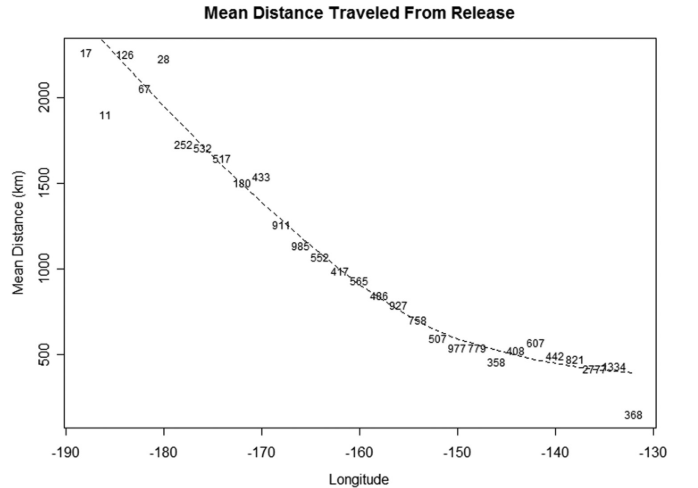

```{r setup, include=FALSE}
library(icon)
options(htmltools.dir.version = FALSE)
knitr::opts_chunk$set(warning = FALSE, message = FALSE,
                      comment = NA, rows.print = 16)
```
<!-- layout: true -->
<!-- .header[`r icon::fa('github')` @mkapur] -->

---
# Dissertation Goals
.large[
+ Provide needed science evaluating alternative
spatial management strategies for stock assessment
+ Title: **Implications of Spatial Mis-specification in
Management Strategy Evaluation for North
Pacific Sablefish**]
---
# .inverse[ Motivation I: Sablefish]
---
background-image: url("nepmap.jpg")
background-position: center
background-size: contain
<br><Br><br><Br>
---
background-image: url("regional_biomass.png")
background-position: center
background-size: contain
<br><Br><br>

???
group came together in 2018
this couples with some anecdotes (recruitment) led us to examine
where there may be a mismatch in the actual demography of sab, and our managemetn framework
and more importantly what effects those choices have on resultant management estimates
---
# Research Questions

## Sablefish Specific

+ What is the current spatial structure of sablefish demography (namely growth) across the NE Pacific?

--

+ Can a spatially-explicit, range-wide operating model produce similar population dynamics as suggested by the current regional assessments? 

--

+ If not, how distinct are the dynamics produced by such an operating model? 
---
#.inverse[ Motiviation II: Science]
---

background-image: url("Puntetal2015.png")
background-position: right
background-size: contain

.pull-left[
+ A fair bit has been done on spatial mis-match vs. estimation uncertainty.

+ Lesser work on how spatial misspecification flows into HCR performance

]
???

explain what we do know -- summarize major research

will show slide later with actual questions but whant to acknolwege
that this is using sab as case study and aims to encompass tradeoffs between 
spatial strucutre at both the operational and estimation levels, as well as evaluate performance of various
alternative HCRs


---
# Research Questions

## Broader

+ What happens to estimated quantities when spatial structure diverges from reality?

--

+ Are there combinations of HCRs/Spatial assessment frameworks which *reduce undesirable outcomes for the sablefish fishery or population*?

---
# Quick overview: Chapters & Status
+ CH1: Spatial Variation in sablefish growth **(published)**
+ CH2: An Operating Model for NE Pacific Sablefish **(document ~finalized)**
+ CH3: A Management Strategy Evaluation for NE Pacific Sablefish 
+ CH4: Sneaking up on a well-specified model **(internal review)**

---
.header[`r icon::fa('github')` @mkapur/sab-growth]
# Chapter 1: Spatial Growth Variation
+ Genetic & tagging work says the stock is well mixed
.pull-left[ .small[Jasonowicsz et al. 2017] ]
.pull-right[ .small[Hanselman et al. 2015]]
 
--

+ Simple question, not-so-easy to answer

---
.header[`r icon::fa('github')` @mkapur/sab-growth]
## Chapter 1: Spatial Growth Variation
### A method to detect spatio-(temporal) breakpoints

+ “Let the data talk”

+ Fit a Generalized Additive Model (GAM) to a single age and sex

+ Smoothers for year, latitude, and longitude

+ Evaluate 1st derivative of each smoother to see where it is changing most
---
background-image: url("Screenshot (38).png")
background-position: center
background-size: contain
.header[`r icon::fa('github')` @mkapur/sab-growth]

---
background-image: url("Screenshot (39).png")
background-position: center
background-size: contain
.header[`r icon::fa('github')` @mkapur/sab-growth]

---
background-image: url("Screenshot (40).png")
background-position: center
background-size: contain
.header[`r icon::fa('github')` @mkapur/sab-growth]

---
background-image: url("BLACK_sab_smooth_map_4F.png")
background-position: center
background-size: contain
.header[`r icon::fa('github')` @mkapur/sab-growth]

???
transpose me onto a map
---
background-image: url("demog_dark.jpg")
background-position: center
background-size: cover
.header[`r icon::fa('github')` @mkapur/sab-growth]
---
.header[`r icon::fa('github')` @mkapur/sab-growth]
## Chapter 1: Spatial Growth Variation

<br><br>
.center2[
```{r, echo = FALSE,  out.width="50%", fig.show="hold"}
knitr::include_graphics(c("demog_dark.jpg","BLACK_Figure5_no130.png"))
```
]
---
.header[`r icon::fa('github')` @mkapur/sab-growth]
## Chapter 1: Spatial Growth Variation
```{r, echo = FALSE, out.width="50%", fig.show="hold"}
knitr::include_graphics(c("demog_dark.jpg","OMGrowthCurves_BLACK_2020-05-11.png"))
```
---
.header[`r icon::fa('github')` @mkapur/sab-growth]
## Chapter 1: Spatial Growth Variation
## Status: Published


---
## Chapter 2: An Operating Model for NE Pacific Sablefish

--

+ How is the model structured?
+ What are the key assumptions?
---
background-image: url("demog_dark.jpg")
background-position: center
background-size: cover
.header[`r icon::fa('github')` @mkapur/sab-mse]

---
background-image: url("demog_dark2.jpg")
background-position: center
background-size: cover
.header[`r icon::fa('github')` @mkapur/sab-mse]
---
background-image: url("map-regions_50n_full_dark.png")
background-position: center
background-size: cover
.header[`r icon::fa('github')` @mkapur/sab-mse]
---
background-image: url("demog_dark3.jpg")
background-position: top
background-size: contain
.header[`r icon::fa('github')` @mkapur/sab-mse]

.center2[
.inverse[What Happens where?]<br>
.inverse[Management Regions (EEZ)] <Br>
Alaska (AK), British Columbia (BC), Cal. Current (CC)
  + Contain fleets
  + Accrue catches
  + Set ABCs (future)
]


---
background-image: url("demog_dark2.jpg")
background-position: center
background-size: contain
.header[`r icon::fa('github')` @mkapur/sab-mse]


.center2[
.inverse[What Happens where?]<br>
.inverse[Stocks]
+ Share params for growth, maturity, density-dependence
+ SRR operates @ stock and is partitioned

]
---
background-image: url("map-regions_50n_full_dark.png")
background-position: center
background-size: contain
.header[`r icon::fa('github')` @mkapur/sab-mse]
<Br><Br><Br><br><Br><Br><Br>
.center2[
.inverse[What Happens where?]<br>
.inverse[Sub-areas]
+ Smallest unit in OM; monitor numbers-at-age
]
---
.header[`r icon::fa('github')` @mkapur/sab-mse]
## Important OM Equations
### .small[Numbers at Age]
$N_{y+1,\gamma,a}^i=\left\{\begin{matrix}0.5R_{y+1}^i & \text{if}\ a = 0 \newline \sum_{i\neq j}\left[\left(1-\textbf{X}_a^{i,j}\right)\left.\ {N_{y,\gamma,a-1}^ie}^{-Z_{y,\gamma,a-1}^i}\right.+\textbf{X}_a^{j,i}{N_{y,\gamma,a-1}^je}^{-Z_{y,\gamma,a-1}^i}\right] & \text{if}\ 1 \leq a <A\\\sum_{i\neq j}{\left[\left(1-\textbf{X}_a^{i,j}\right)(\left.{N_{y,\gamma,A-1}^ie}^{-Z_{y,\gamma,A-1}^i}\right.\left.+{N_{y,\gamma,A-1}^ie}^{-Z_{y,\gamma,A-1}^i}\right.)\right.\ } & \text{if}\ a = A \\\ldots+\left.\textbf{X}_a^{j,i}\left({N_{y,\gamma,A}^je}^{-Z_{y,\gamma,A}^j}+{N_{y,\gamma,A-1}^je}^{-Z_{y,\gamma,A-1}^j}\right)\right]\\\end{matrix}\right.$
+ Yearly timestep
+ Monitored by sub-area $i$
+ Movement defined by $\textbf{X}^{i,j}_a$


---
.header[`r icon::fa('github')` @mkapur/sab-mse]
# Important OM Equations
## Reproduction I
$R_y^k=\frac{4h^kR_0^kS_y^k}{S_0^k\left(1-h^k\right)+S_y^k(5h^k-1)}e^{-0.5\sigma_R^2+{\widetilde{R}}_y^k}$ 

$S_y^k=\sum_{a}{\phi_{ik}N_{y,\gamma=female,a}^iw_{y,\gamma=female,a}^kE_a^k}$ 

+ Density dependence spatial Bev-Holt at stock level $k$
+ SSB in $k$ is summation over $i$ in $k$ (invoke the magic of $\phi_{ik}$)

---
.header[`r icon::fa('github')` @mkapur/sab-mse]
# Important OM Equations
## Reproduction II
.large[
$R_y^i=\tau_{ik}R_y^k$ 
]

+ Recruitment happens at stock $k$ and is partitioned into sub-area $i$
+ $\tau_{ik}$ user-defined, by geographic area

---
.header[`r icon::fa('github')` @mkapur/sab-mse]
# Important OM Equations
# Retained Catches
$C_y^{m,f}=\sum_{i\epsilon m}\sum_{\gamma}{\sum_{a}{\phi_{if}w}_{\gamma,a}^f\frac{s_{\gamma,a}^fF_y^f\mathrm{\Omega}_{y,\gamma,a}^f}{Z_{y,\gamma,a}^i}N_{y,\gamma,a}^i(1-e^{-Z_{y,\gamma,a}^i})}$

+ Tune $F$ via hybrid method
+ $\Omega$ is retention function
+ $\phi_{if}$ matches sub-areas to fleets

---
## Chapter 2: Operating Model
## Status: Document written; code in development

---
## Chapter 3: Management Strategy Evaluation
What do we need for an MSE? <br>

--

.inverse[What do we want to test?]

---
## Chapter 3: Management Strategy Evaluation
### What do we want to test?
+ What happens to estimated quantities when spatial structure diverges from reality?
+ Are there combinations of HCRs/Spatial assessment frameworks which *reduce undesirable outcomes for the sablefish fishery or population*?


???
A suite of EMs which capture the uncertainty we are most interested in,
and performance metrics to measure output

---
background-image: url("mse1.png")
background-position: center
background-size: cover
.header[`r icon::fa('github')` @mkapur/sab-mse]
---
background-image: url("mse2.png")
background-position: center
background-size: cover
.header[`r icon::fa('github')` @mkapur/sab-mse]
---
background-image: url("mse3.png")
background-position: center
background-size: cover
.header[`r icon::fa('github')` @mkapur/sab-mse]

---
# What I expect to find out:
+ Is the current sab management paradigm performing worse than transboundary management could?
+ Are there key processes that dictate that answer?
+ Another nail in the space-rules coffin
---
## Chapter 3: Management Strategy Evaluation
## Status: Teams assembled for EM, HCR & Performance Metrics

---
## Chapter 4: Sneaking up on a well-specified model

## Mis-specification: What Happens?

.pull-left[
+ Estimates are biased/imprecise
]

.pull-right[
![](ikea.jpg


---

# Research Questions

+ Do we need to fix every mis-spec before the model performs “well”? 

+ Are certain mis-specifications more or less influential on model bias? 

???
- guiding questions: quantity and identity
- second is like asking are putting the legs on right more important than the back?
---
---
# .inverse[extra material]
---
paste in some OM equations
validation of method from CH1
