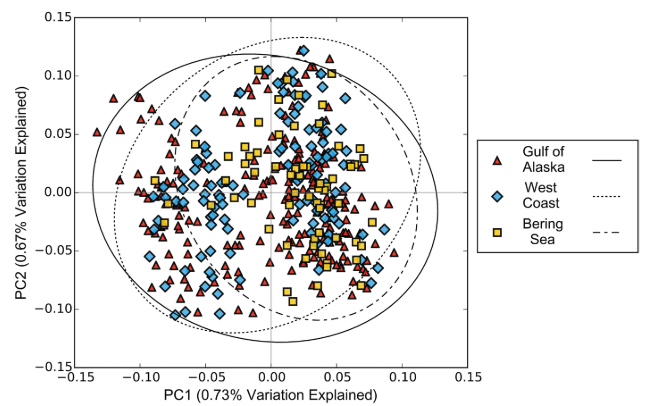
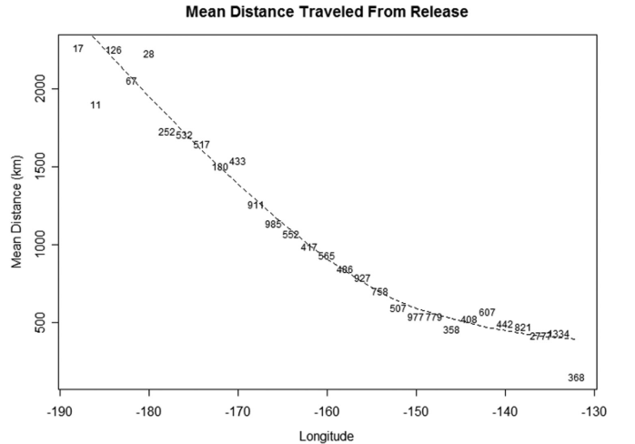

```{r setup, include=FALSE}
library(icon)
options(htmltools.dir.version = FALSE)
knitr::opts_chunk$set(warning = FALSE, message = FALSE,fig.align='center',
                      fig.width = 4, fig.height = 5, 
                      comment = NA, rows.print = 16)
```
layout: true
.header[`r icon::fa('github')` @mkapur]

---
# Dissertation Goals
.large[
+ Provide needed science evaluating alternative
spatial management strategies for stock assessment
+ Title: **Implications of Spatial Mis-specification in
Management Strategy Evaluation for North
Pacific Sablefish**]

---
background-image: url("nepmap.jpg")
background-position: center
background-size: contain
<br><Br><br><Br>
# .inverse[ Motivation I: Sablefish]

---
# .inverse[ Motivation I: Sablefish]

figure from proposal with biomass


---


background-image: url("Puntetal2015.png")
background-position: right
background-size: contain

# Motiviation II: Science

.pull-left[
+ A fair bit has been done on spatial mis-match vs. estimation uncertainty.

+ Lesser work on how spatial misspecification flows into HCR performance

]
???

explain what we do know -- summarize major research
---
# Research Questions

## Sablefish Specific

+ What is the current spatial structure of sablefish demography (namely growth) across the NE Pacific?

--

+ Can a spatially-explicit, range-wide operating model produce similar population dynamics as suggested by the current regional assessments? 

--

+ If not, how distinct are the dynamics produced by such an operating model? 

---
# Research Questions

## Broader

+ What happens to estimated quantities when spatial structure diverges from reality?

--

+ Are there combinations of HCRs/Spatial assessment frameworks which *reduce reduce undesirable outcomes for the sablefish fishery or population*?

---
# Quick overview: Chapters & Status
+ CH1: Spatial Variation in sablefish growth **(published)**
+ CH2: An Operating Model for NE Pacific Sablefish **(document ~finalized)**
+ CH3: A Management Strategy Evaluation for NE Pacific Sablefish 
+ CH4: Sneaking up on a well-specified model **(in review)**

---
# Chapter 1: Spatial Growth Variation
+ Genetic & tagging work says the stock is well mixed
.pull-left[ .small[Jasonowicsz et al. 2017] ]
.pull-right[ .small[Hanselman et al. 2015]]
 
 --
 
 <br><br>
 
+ Simple question, not-so-easy to answer

---
## Chapter 1: Spatial Growth Variation
### A method to detect spatio-(temporal) breakpoints

+ “Let the data talk”

+ Fit a Generalized Additive Model (GAM) to a single age and sex

+ Smoothers for year, latitude, and longitude

+ Evaluate 1st derivative of each smoother to see where it is changing most
---
background-image: url("Screenshot (38).png")
background-position: center
background-size: contain
---
background-image: url("Screenshot (39).png")
background-position: center
background-size: contain
---
background-image: url("Screenshot (40).png")
background-position: center
background-size: contain
---
## Chapter 1: Spatial Growth Variation
need BLACK map of new breaks 
???
transpose me onto a map

---
## Chapter 1: Spatial Growth Variation
BLACK map of growth estimates
---
## Chapter 1: Spatial Growth Variation
maturity and movement, if available

---
## Chapter 2: An Operating Model for NE Pacific Sablefish
+ How is the model structured?
+ What are the key assumptions?
---
## Chapter 2: An Operating Model for NE Pacific Sablefish
breakpoints map, add labels
consider doing "buildup" of model structure as in OM talk

---
## Chapter 3: Management Strategy Evaluation
+ Revisit the questions
+ What we need to do this

---
## Chapter 4: Sneaking up on a well-specified model
insert slides from quantsem


---
# My Contribution
+ Is the current sab management paradigm performing worse than transboundary management could?
+ Are there key processes that dictate that answer?
+ Another nail in the space-rules coffin
---
---
# .inverse[extra material]
---
paste in some OM equations
validation of method from CH1
