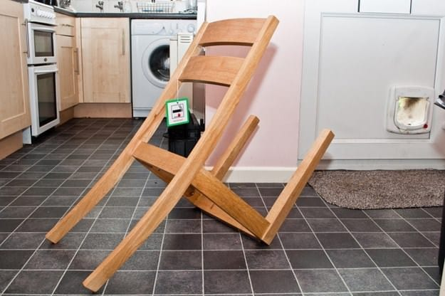
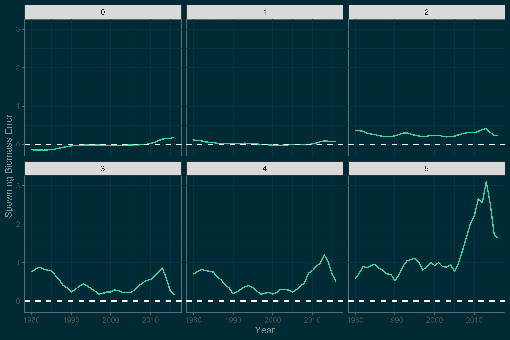
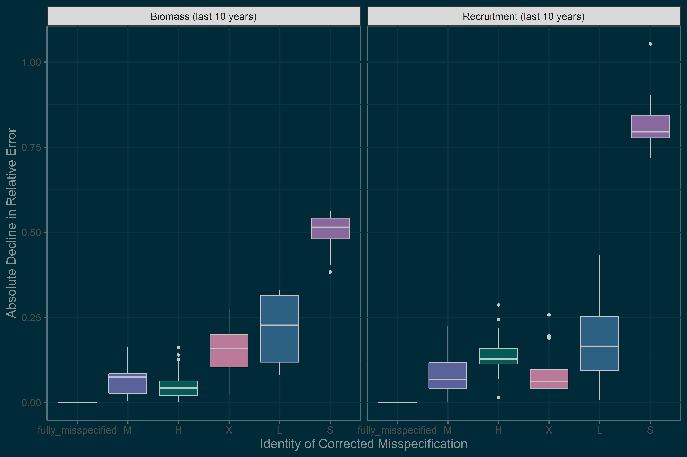

```{r setup, include=FALSE}
library(icon)
options(htmltools.dir.version = FALSE)
knitr::opts_chunk$set(warning = FALSE, message = FALSE,fig.align='center',
                      fig.width = 4, fig.height = 5, 
                      comment = NA, rows.print = 16)
```
layout: true
.header[`r icon::fa('github')` @mkapur/sneak]

???
---
background-image: url("Screenshot (43).png")
background-size: contain
???
Collab & 4th chapter
- Familiar faces
- Exactly 1 yo when project was starting out gave think tank on this
---
background-image: url("https://opuszine.us/_assets/entries/cassini-retirement.jpg")
background-size: contain

???

- at that time I used an analogy from this netflix documentary series to introduce concept of misspecification


--

<br><Br><bR>
# .inverse[ Mis-specification]
???
- show had rocket scientists obsessed w 20s v 2 mins on accuracy 
- wild bc goal was to blow up rocket
- I work on a diff type of model (stock ass used for mgmt.) 
- but spend a lot of time thinking about the causes and ocnsequences of misspecification, 
- for us 20s may be 20000 mt w  flow on effects for livelihoods
- Regardless of whether u saw my talk last year, hope to update you on the dev
- & findings of this work which is now in review


---

background-image: url("https://opuszine.us/_assets/entries/cassini-retirement.jpg")
background-size: contain


# .inverse[ Mis-specification]

<Br><Br><Br><br>
.darktext[ 
+ You did something wrong.
+ Model (wrong selectivity form)
+ Process (wrong stock-recruit)
+ Data (amount or quality)
+ And more!
]


---

## Mis-specification: What Happens?

.pull-left[
+ Estimates are biased/imprecise
]

--
.pull-right[

]

???
- Why do we care -- what is the outcome?
- Not concerned w fishery/assessment specifics bc thrust @ IPM @ large
- core concern is that misspec = estimates that are biased/imprecise
- Fisheries outcomes feed into mgmt
- other systems make decisions like whether ESA or determine siting of closed area 


- pause to address non-modelers
- next slides nitty-gritty moving parts
- as i worked on this ikea analogy
- if you start to get lost, come back to think of study as all ways to wrongly assemble chair
- and how easy to sit in it
- will circle back to metaphor


---

# Research Questions

+ Do we need to fix every mis-spec before the model performs “well”? 

+ Are certain mis-specifications more or less influential on model bias? 

???
- guiding questions: quantity and identity
- second is like asking are putting the legs on right more important than the back?

---

# Simulation Study

+ Statistical catch-at-age operating model

+ Iteratively create and ‘correct’ mis-specifications

+ Calculate comparative statistics on derived quantities

???

- let's go through some schematics to illustrate how this looks

---
background-image: url("Screenshot (1).png")
background-position: center
background-size: contain

???
- start with OM
- OM is like manual version of ikea, truth about pop dynamics, params, structure
- "gold standard"
- pop quantities like biomass in system etc
---
background-image: url("Screenshot (2).png")
background-position: center
background-size: contain
???
- take om, data that it generates and tweak it a little bit to build EM (green)
- the EM can be iether similar to or very different from the OM

---
background-image: url("Screenshot (3).png")
background-position: center
background-size: contain
???
- but what it does do is also print population quantities
- of course the values in those vectors are diff because it underwent some misspec
- now can make a comparison and basically determine how much worse off we are
---
background-image: url("Screenshot (4).png")
background-position: center
background-size: contain
???
- go thru again but more detail
- start w OM, build em fully misspec everything wrong
- say we build a second EM with one fewer misspec, or one correction
---
background-image: url("Screenshot (5).png")
background-position: center
background-size: contain
???
- now we have three sets of pop quants
- and two relative errors, bc we always compare the chair we built (em) to the manual (OM)
---
background-image: url("Screenshot (6).png")
background-position: center
background-size: contain
???
- other cool thing that arises is we keep track of IDENTITY  what we went in and corrected
- meaning we can write down the change in relative error, or improvement associated with that misspec
---
background-image: url("Screenshot (7).png")
background-position: center
background-size: contain
---
background-image: url("Screenshot (8).png")
background-position: center
background-size: contain

???
we take th EM w everything wrong you'd possibly want
then make another EM which is slightly less wrong, 
has one misspecification correted
now we have 3 sets of pop quants
and two relerrs, because recall taht we compare the estimation models
or wrongly built chairs to the om, the truth

---
background-image: url("Screenshot (10).png")
background-position: center
background-size: contain
---
background-image: url("Screenshot (11).png")
background-position: center
background-size: contain
---
background-image: url("Screenshot (12).png")
background-position: center
background-size: contain
---
<Br><Br>
##.inverse[1) Do we need to fix every mis-spec <br> before the model performs “well”? ]
---
background-image: url("exOM1_E1.png")
background-position: center
background-size: contain
???

This is question of quantity - do wee need too...
Now this data is not my real results, this is completely fake for illustration
y axis is relative error, x is # of misspecifications present,
good news for this fake example is that with fewer misspecs the error goes down
doesnt appear to be that great until about XX

---
background-image: url("exOM2_E1.png")
background-position: center
background-size: contain
???

This is question of quantity - do wee need too...
Now this data is not my real results, this is completely fake for illustration
y axis is relative error, x is # of misspecifications present,
good news for this fake example is that with fewer misspecs the error goes down
doesnt appear to be that great until about XX

---
background-image: url("exOM3_E1.png")
background-position: center
background-size: contain

--

# .inverse[Models do better with fewer misspecs `r emo::ji("shrug")`]
???


This is question of quantity - do wee need too...
Now this data is not my real results, this is completely fake for illustration
y axis is relative error, x is # of misspecifications present,
good news for this fake example is that with fewer misspecs the error goes down
doesnt appear to be that great until about XX

---


##.inverse[2) Are certain mis-specifications <Br> more or less influential on model bias?  ]

```{r, eval = TRUE, echo = FALSE, warning = FALSE, message = FALSE, fig.width=8, fig.height=6, fig.align='center', fig.retina=2}
dat <- data.frame("SPECID" = letters[1:5], "ABSRELE" = sort(c(runif(2,0.5,0.75),
                                                     runif(3,0.15,0.6))))
idrel <- ggplot(dat, aes(x = SPECID, y = ABSRELE, fill = SPECID)) +
  ggsidekick::theme_sleek(base_size = 16)+
  labs(x = "Identity of Corrected Misspecification", y = "Absolute Decline in Relative Error", fill = "") +
  scale_y_continuous(limits = c(0,1)) +
  scale_fill_manual(values = c('black','gold','orange','dodgerblue2','pink')) +
  geom_bar(stat = 'identity', color = 'white') 
idrel
```
???
recall that each EM has a correction, and that enables us to detect what happened when something was corrected
again this is fake
---

### Why this hasn't been done before...

```{r, eval = TRUE, echo = FALSE, warning = FALSE, message = FALSE,fig.show = "hold", out.width = "20%",out.height='20%', fig.align = "default"}
idrel

```

--

<Br><Br>
.large[
.inverse[N! unique “strings” of ordered mis-specs]
]

---
background-image: url("Screenshot (26).png")
background-position: center
background-size: contain

???
let's talk about misspecs we explored
there are 380+ in a given model
and also keep combinations low bc factorial contrib

but wanted to look at those that are commonly used in IPMs, or have analogies
these terms might be fisheries specific but basically any ipm will have
params representing how animals grow, survive, and their reproductivity


for this group, generally process, misspec straightfwd, fix at wrong value


---
background-image: url("Screenshot (27).png")
background-position: center
background-size: contain
---
background-image: url("Screenshot (28).png")
background-position: center
background-size: contain


???
-final one is most interesting to me and that is sptl structure 
-om is 2 areas, with movement from one to another
-EM misspec assesses all as 1
-this is a rich and active area of research in IPMs & fisheries assessment
-we know that getting space wrong can be fairly detrimental to density dependence and other things
-but particularly interested in seeing how impactful this aspect is in context of other important processes

-NOTE COLORED SQUARES
---
background-image: url("Screenshot (13).png")
background-position: center
background-size: contain

???
So what i've done here is taken a figure from a few slides back
- with OM little square on left
- stack of 6 ems on right, now having colored squares representing the EMs


---
background-image: url("Screenshot (14).png")
background-position: center
background-size: contain

???
-rotate this graphic and showing it again in at the top
-what this row represents is the 6 ems corresponding to a unique order of correction
- with space fixed first, growth (black) second, and so on
---
background-image: url("Screenshot (15).png")
background-position: center
background-size: contain
???
- fixing space first every time, that leaves us with 4! combos of the remaining misspecs


---
background-image: url("Screenshot (16).png")
background-position: center
background-size: contain

--

<br><br><br><br><Br><Br><br><br><br><br><Br><Br>

.pull-left[
14,400 = 50 OM replicates <Br>
x 2 Experiments <Br>
x 24 "strings" <br>
x 6 EMs

]

???
- also looked at the same thing but space last
- the reason we did it this way is two fold; wanted to avoid going in and changing the spatial structure of the model multiple times
- also were interested in the precedence of this feautre which is so widely studied.
for example E2 allows us to ask, if you got everything else right, is it really so great to get space done?
---
# Performance Metrics
+ Estimated recruitment over time
+ Estimated stock spawning biomass over time
+ Both quantities within last 10 years

---
# .inverse[Results]

---
background-image: url("SSB_error_panel_E1_dark.png")
background-position: center
background-size: contain

???
I will walk through the hilites of results, as you can imagine there is a lot to wade thru with 14,000 model outputs
these are from E1. we are seeing what we would expec
as misspecs go down so does rel err, with the most correct model being
the most correct
---
background-image: url("SSB_Terminal_Tile_E1.png")
background-position: center
background-size: contain
???
the more interesteing question is, what is the identity of those misspecs that give us the most bang for our buck?
this plot is averaged across OMs etc and shows the abs relative error... etc
the x axis has the # of misspecs aka the panels on previous
and the colors are the amt of relative error for the last 10 years SSB
the labels tell you what is misspecified in the model
the more yellow, the better
what we see here is that going from 5 to 4 misspecs has an outsize pos effect on rel err,
which is interesting because in every single case that was where we fixed spatial structure
improvements continue after that, but the biggest decline happens at that initial step
---
background-image: url("SSB_Terminal_Tile_E2.png")
background-position: center
background-size: contain

???

amazingly the exact inverse trend was found for e2
this plot is structured the same way, with the labeled letters tellin you what's wrong with this model
as we expect, we do see the model getting more oand more correct with fewer misspecs, but we never get into the "yellow zone" until space is cleared up.

Another interesting thing we can see from this plot is what besides space seems to have a possitive effect

point out clusters of lighter things, in this second column we are only correcting one thing
and it appears that having X and L right we get a bigger jump
---

???
can show these results in the format i introduced at the beginning, where we see the spread 
of absolute changes in relErr accodring to identity.
What is cool is that for this experiment, space wasn't corrected till the very end but STILL had the largest impact on relative error (this is delta-prev)

---
background-image: url("Rec_error_panel_E1_dark.png")
background-position: center
background-size: contain

???
one other interesting result to share
hree is E1 again but for recruitment
same general idea but whacky banding
---

background-image: url("Rec_error_M_E1_dark.png")
background-position: center
background-size: contain
---
background-image: url("https://opuszine.us/_assets/entries/cassini-retirement.jpg")
background-size: contain
## .inverse[ Making sense of a massive study]

???
if there is one takeaway, it is that i was psychic when i picked the casini space misison
as the analogy last year,
because actually at the time of thinktank weren't considering space
because too hard to implement (but alas grad school)
the reason it was so wild is that...
---
background-image: url("https://opuszine.us/_assets/entries/cassini-retirement.jpg")
background-size: cover
## .inverse[ Making sense of a massive study I]

--

.pull-left[
.large[
.inverse[
+ Space matters most for both biomass & recruitment
]]]

.pull-right[
]

???
first technical takehoms 
spatial structure ended up having the most outsize influence on model estimates
and incredibly this held true regardless of whether or not every other imporant thing was right
as wee saw from the colored tileplots from both experiments
whether space was corrected first or last, you got the most bang for your buck

---
background-image: url("https://opuszine.us/_assets/entries/cassini-retirement.jpg")
background-size: cover
## .inverse[ Making sense of a massive study I]

.pull-left[
.large[
.inverse[
+ Space matters most for both biomass & recruitment
+ Natural mortality induces systematic bias in recruitment
+ For biomass, having growth & selectivity right first is key
]
]
]

.pull-right[
]

???

there were also interesting sub-findings of this work
which was that even once you got spatial structure right,
having misspec M will guarantee that your model outputs are biased,
and we can even predict the direction depending whether M is hi or low.

finally exp 2 revaled that while space is most important, the quickest reduction in
relerr came from correcting growth and selex early on.

---

background-image: url("https://opuszine.us/_assets/entries/cassini-retirement.jpg")
background-size: contain

## .inverse[ Making sense of a complex study II]

.pull-left[
.inverse[
.large[
+ These studies are...very involved 
]
]
]

.pull-right[
]

???
now for some more big picture takeaways
what we've done here is produce a huge and detailed dataset
the analysis i've done here is pretty straightforward, just summing/averaging relErr
i feel that is the easiest to digest for broad audience
and i'll be the first to say that as i worked up results i sense that this is hungry for optimization
algo, so i'd be realy happy to collab on subsequent publications with folks with experience in those areas because i think there is more to be mined from it

Potential for ML algorithm, lots of data exploration etc
---
background-image: url("https://opuszine.us/_assets/entries/cassini-retirement.jpg")
background-size: contain
## .inverse[ Making sense of a massive study II]

.pull-left[
.inverse[
.large[
+ These studies are...very involved 
+ Basic changes = enormous consequences on model estimates
+ Empirical research is worth a lot!
]
] 
]
.pull-right[
]
???
the final thing is really directed towards the folks working on the research that directly informs 
our params. if you are someone cutting up fish heads to nail Linf, or perhaps doing genetic work to determine if there is >1 stock in an area, my hope is you can point to this work to re-emphasize the direct, specific contribution your findings will have on the accuracy of our management science.

---
<Br>
# .inverse[thanks]
kapurm@uw.edu


---

---
background-image: url("SSB_error_M_E1.png")
background-position: center
background-size: contain


???
SSB vs M E1
not as prnounced
---

background-image: url("RecrTerminal_Tile_E1.png")
background-position: center
background-size: contain
???
recr e1
---

background-image: url("RecrTerminal_Tile_E2.png")
background-position: center
background-size: contain
???
recr e2
---
background-image: url("Screenshot (22).png")
background-position: center
background-size: contain
---
background-image: url("Screenshot (23).png")
background-position: center
background-size: contain
---
background-image: url("Screenshot (24).png")
background-position: center
background-size: contain
---

background-image: url("Screenshot (25).png")
background-position: center
background-size: contain
---
# .inverse[More OM Variation Slides]
---
background-image: url("S3_recdevs_mainpd.png")
background-position: center
background-size: contain

---
background-image: url("S4_Surveys_2Areas_Error.png")
background-position: center
background-size: contain

---
background-image: url("selex_compare_1.png")
background-position: center
background-size: contain

---
background-image: url("summaryF_All.png")
background-position: center
background-size: contain
