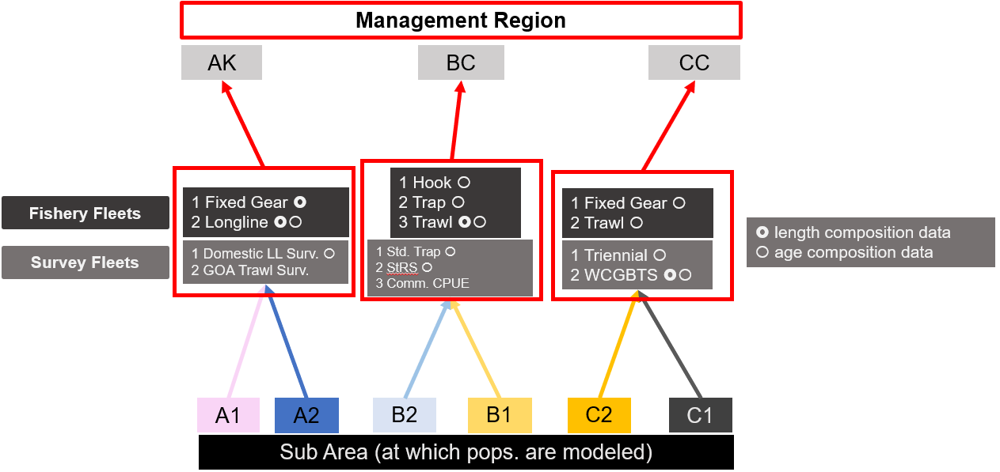
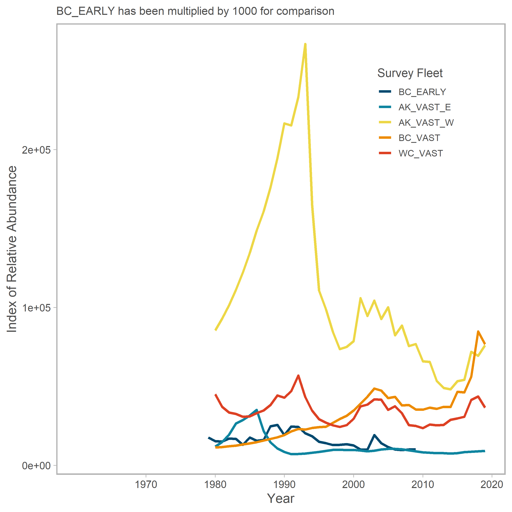
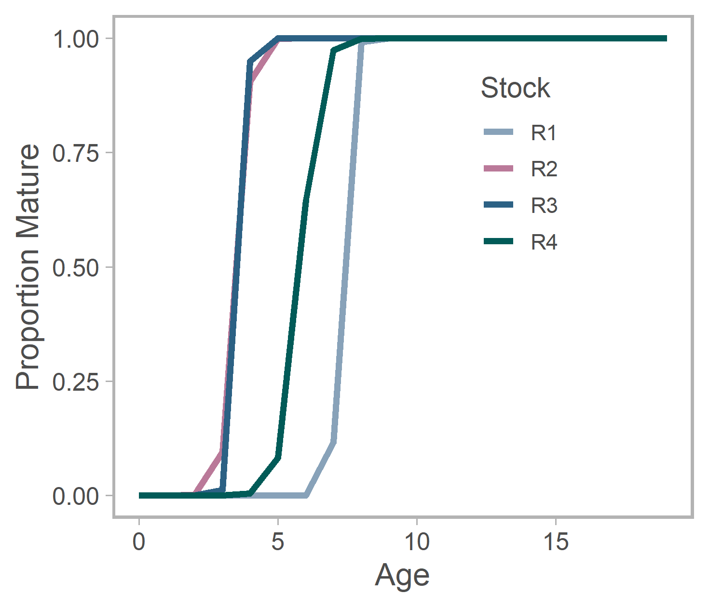

```{r options, include = FALSE, eval = TRUE}
knitr::opts_chunk$set(warning = FALSE, message = FALSE,fig.align='center',
                      fig.width = 3, fig.height = 3,
                      comment = NA, rows.print = 16)
```

layout: true

.header[`r icon::fa('github')` @mkapur/sab-mse/]

---

# Outline
.inverse[Ground Floor OR the 30,000 foot view]
+ Why a transboundary, spatial OM for Sablefish?
+ Basic model structure
+ Preliminary results & where this is headed


--


+ Discuss as we go (interrupt me  `r emo::ji("smile")`)

???
Don't forget that it is easy to add n selex curves, harder to change the array structure

---
# .inverse[ Motivation I: Sablefish]
---
background-image: url("./img/nepmap.jpg")
background-position: center
background-size: contain
<br><Br><br><Br>
---
background-image: url("./img/regional_biomass2.png")
background-position: center
background-size: contain
<br><Br><br>

???
group came together in 2018
this couples with some anecdotes (recruitment) led us to examine
where there may be a mismatch in the actual demography of sab, and our managemetn framework
and more importantly what effects those choices have on resultant management estimates

---
#.inverse[ Motiviation II: Science]
---
#.inverse[ Motiviation II: Science]

.pull-left[
+ A fair bit has been done on spatial mis-match vs. estimation uncertainty.
]

.pull-right[

]
---
#.inverse[ Motiviation II: Science]

.pull-left[
+ A fair bit has been done on spatial mis-match vs. estimation uncertainty.

+ Less work on how spatial misspecification flows into harvest control rule (HCR) performance

]


.pull-right[


]
???
- study enabled by strong basis of extant work examining the mismatch between spp and assessment structure
- figure from AEP paper but there are many for generalized or specific fisheries
- what was done is build spatially explicity OM and assess using frameworks which either ignore or acct for 
- sptl structure w varying degree of accuracy (panels)
- takeaway here, corroborated elsewhere, is that if you ignore space completely you get bias garanz (top rows)
- also spatial models typically less precise (sample size, npar)
- ALSO there are intermediate approximations which perform decently

- this means we are fairly confident that our impost assessment framework is introducing bias in SAB
- no need to write the post about that
- question arises about the feedback, or interplay, between the degree of bias and our control rules
- used to determine catch.
- to date most work fixes a level of F either a sub-area or system wide scale and investigates depl


---

background-image: url("https://www.thoughtco.com/thmb/Bt4hhUDgr_LhLP5hEh6pP_2o2iM=/768x0/filters:no_upscale():max_bytes(150000):strip_icc()/closed-lift-door-1051317118-5c64607a46e0fb0001587ce5.jpg")
background-size: cover
<br><br><br>
# .inverse[Ground Floor]

---
# Ground Floor

+ OM is run in `R` 
+ Conditioning/estimation happens in `TMB` 
+ We are `not` shooting to replicate Stock Synthesis (etc.) exactly in structure nor estimated quantities 


???
For example, R scripts pre-process the data, but TMB code uses that data to produce an expected Numbers-at-age matrix, estimate parameters, etc, then pass back to R for plotting
---

background-image: url("./img/map-EEZ_strata_stock.png")
background-size: contain
# Spatial Structure of OM

???
the truth about the stock
perhaps more complex than you expected?
useful ot walk thru how this arose

---
background-image: url("./img/map-EEZ_mgmt.png")
background-size: contain
---
background-image: url("./img/map-EEZ_mgmt_growth.png")
background-size: contain
???
my first chapter was an analysis of spatial growth variation
identified these major breaks in red lines which, as described in the paper...
---
background-image: url("./img/map-EEZ_growth_currents.png")
background-size: contain
.inverse[Kapur et al., 2020. Oceanographic features delineate growth zonation in Northeast Pacific sablefish. <i> Fish. Res. </i>]
???
...correspond with major oceanographic features
---
background-image: url("./img/map-EEZ_strata_nolab.png")
background-size: contain
???
so the union of these two stratifications -- the political EEZs and the demographic units,
gives rise to the 6 modeled areas in our OM
---
background-image: url("./img/map-EEZ_strata_lab2.png")
background-size: contain
--
<Br><Br><br><Br><Br><br><Br><Br><br><Br><br>

+ .inverse[The labeled strata are the *smallest* modeled unit]

--

+ .inverse[Similarly-colored areas share demography (stock-recruit, growth)]

--

+ .inverse[Fleets accrue to *management areas* (Alaska, BC or Cal. Current)]


???
Lots of info here. What's important for you to know is that


---
background-image: url("https://dynaimage.cdn.cnn.com/cnn/q_auto,h_600/https%3A%2F%2Fcdn.cnn.com%2Fcnnnext%2Fdam%2Fassets%2F191202162449-ingredients-to-longevity-3.jpg")
background-size: cover
<br>
# .inverse[Data Inputs]
---
# .small[Data Inputs: Catches & Comps]



--

+ `Fixed Gear` for CC is Hook & Line + Pot
+ any others to combine/add/drop?

???
This is figure 2
The last thing I want to add is about survey fleets; those involved with my sptl temporal std work know that i developed a novel index usting VAST. this means that i actually have unique "survey fleets" for each region which are composites
---
# .small[Data Inputs: Surveys]

```{r, out.height = "60%",out.width = "60%", eval = TRUE, echo = FALSE}
# Small fig.width

```
---
# .small[Data Inputs: Growth]

```{r, out.width = "75%", eval = TRUE, echo = FALSE}
# Small fig.width
knitr::include_graphics("./img/OMGrowthCurves_sigma.PNG")
```

---
# .small[Data Inputs: Movement placeholder]
+ Can be binned, but ideally age-specific
+ *Priority from the OM standpoint* is to get movement @ sub-areas


---
# .small[Data Inputs: Maturity ]

```{r, out.width = "75%", eval = TRUE, echo = FALSE}
# Small fig.width

```


---

background-image: url("https://www.thespruceeats.com/thmb/nsjMWi7TBf7AVMBFulYM3XQOYiQ=/2400x1350/smart/filters:no_upscale()/bowl-chili-98839917-56a8c4ab3df78cf772a0723d.jpg")
background-size: cover
<br><br><br>
# .inverse[Data Generation: <Br> Preliminary Results]

---
# Data Generation 
## What comes out of the OM?

Time series of...
+ Surveyed abundance, by fleet
+ Age & Length compositions, by fleet (where applicable)
+ Catch & discards
+ Numbers-at-age/length
+ Biomass 
+ Tuned values e.g. $F$, selectivity, $R_0$

--

...All of which can be used as .inverse[input data] or .inverse[parameter inits] in future EMs.

???
1st three things are basically estimates of the data we put in

---
.large[
.inverse[How do we know if we've done a good job?]

--
<br><br><br><br><br>
.inverse[What can we learn?]

---
# OM Data Generation
.inverse[How do we know if we've done a good job?]
+ The model fits the input data fairly well
+ Our notion of population productivity and exploitation through time doesn't change much *at the management level*

--
.inverse[What can we learn?]
+ Perhaps compensation is occuring in a given direction (ie due to movement)
+ Perhaps we are obtaining an innacurate picture of the population by assessing it separately


???
On the "reproduce" point, I am not positive how well matched it will be dependong on movement outcomes
I can certainly see place for a validation step w movement off

In the dynamics section, when I walk thru equations I will include standout likelihood issues/estimation questions
---
[RESULTS]

